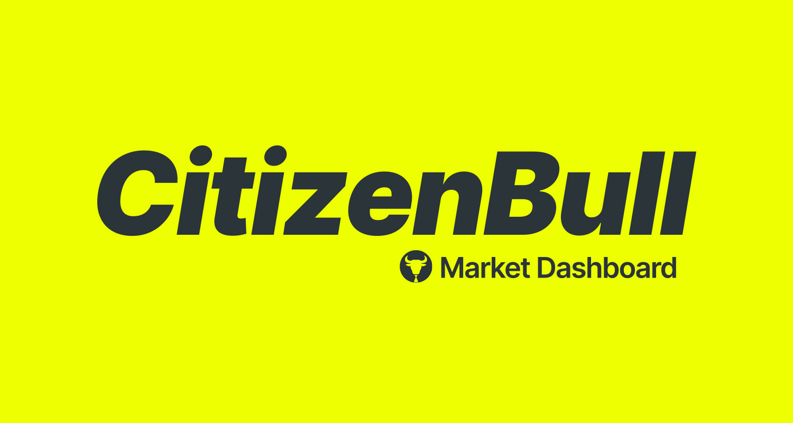

**CitizenBull** is a market dashboard web app that combines real-time stock data, financial news, and weather forecasts into a clean, modular interface. Built with React, it integrates multiple APIs and full user account functionality to simulate a production-ready experience.

> 🌐 **Website:** [citizenbull-fa4ca.web.app](https://citizenbull-fa4ca.web.app)  
> 📁 **GitHub Repo:** [github.com/UglyMice/CitizenBull](https://github.com/UglyMice/CitizenBull)

---

## 🚀 About the Project

CitizenBull was designed and developed as a deep-dive into working with external APIs, authentication, and full-stack web app architecture using React. The project started with simple API testing and evolved into a fully functional dashboard that tracks stock watchlists, weather forecasts, and real-time financial data.

---

## ✨ Features

- 📈 **Stock Watchlist**  
  Add custom tickers and view live data using Finnhub.io.

- 📰 **Company News Feed**  
  View real-time news headlines for selected stocks.

- 🌤️ **Local Weather + Forecast**  
  Displays current conditions and 3-day forecast via WeatherAPI.

- 🕹️ **User Authentication**  
  Secure login/signup with Firebase Auth, including “Continue as Guest” mode.

- 👤 **User Profiles**  
  Save username, location, and profile icon preferences.

- 🧠 **Responsive UI**  
  Clean, mobile-ready design with bento-style layout and reusable components.

---

## 🛠️ Tech Stack

| Front-End      | Back-End     | APIs Used           | Tools           |
|----------------|--------------|---------------------|------------------|
| React (Vite)   | Firebase Auth | WeatherAPI          | Browser DevTools (for layout debugging + testing)         |
| CSS Modules    | Firebase Hosting | Finnhub.io       | Sketch (UI Design) |

---

## 🧭 How to Use

Visit the [live app](https://citizenbull-fa4ca.web.app), sign up (or continue as guest), and start exploring:

- Add stock tickers to your watchlist  
- See real-time financial data and company news  
- View current weather + forecasts for your saved location  
- Use your custom profile and preferences across sessions

---

<strong>Andre Mikel</strong>  
Creative Developer  
<em>andremikel.dev@gmail.com</em>  
[andremikel.dev](https://andremikel.dev/)